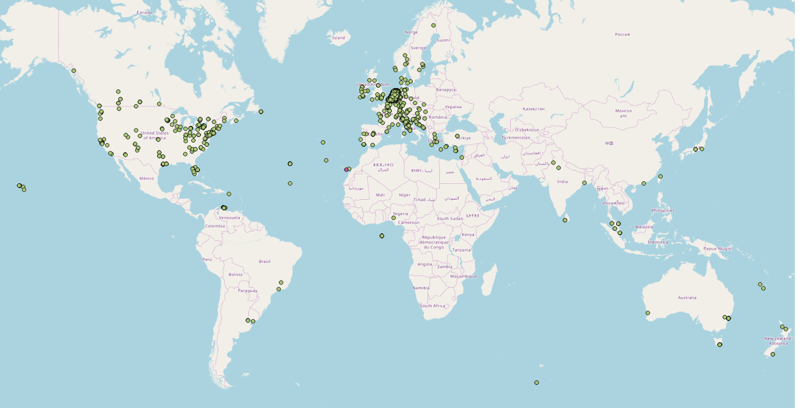

## Requirements

* [gdal - ogr2ogr](http://trac.osgeo.org/gdal/wiki/DownloadingGdalBinaries) 
* [node](https://nodejs.org/en/)

## Run

Visit the site at https://aed.rodekruis.nl/

Copy the authorization header from one of the get requests that goes to https://api-rcr-aed.appdisco.afrogleap.com

Paste the header in `aed.sh` as the value for the `KEY` variable (See current value as example)

Run `aed.sh`

## Result

It produces a [geojson](http://geojson.org/) file, a [shapefile](https://en.wikipedia.org/wiki/Shapefile) and a [spatialite](https://en.wikipedia.org/wiki/SpatiaLite) database in the `./geodata` directory.

